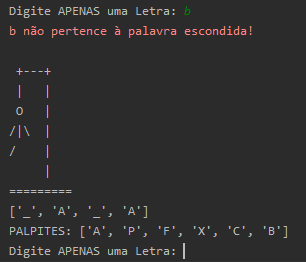

### Capítulo 5 - Python Fundamentos - DSA

Aqui está o meu jogo da forca com um "beep" implementado
a cada jogada realizada.

Aprendi como funciona a classe __ init __ do Python (que foi renomeada para 
start) e foi implementado o SQLite que armazena as palavras a serem escolhidas
no game.

A resposta era JAVA

### Dependências:

- pygame
- sqlite3
